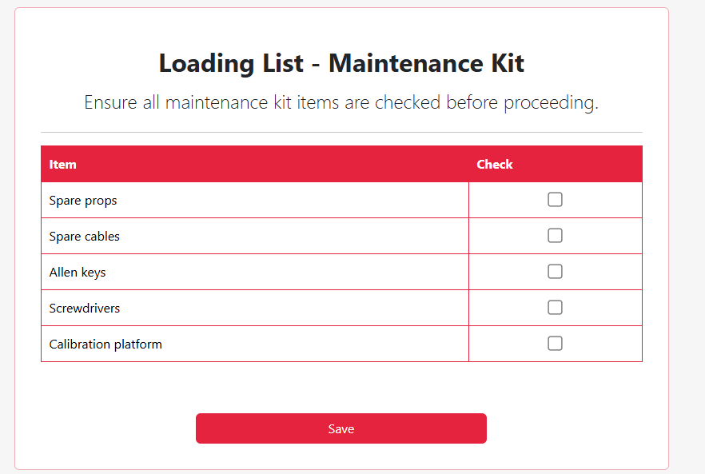
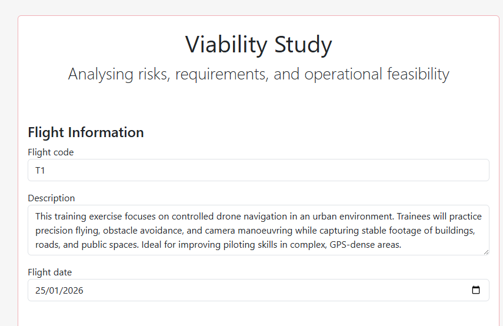
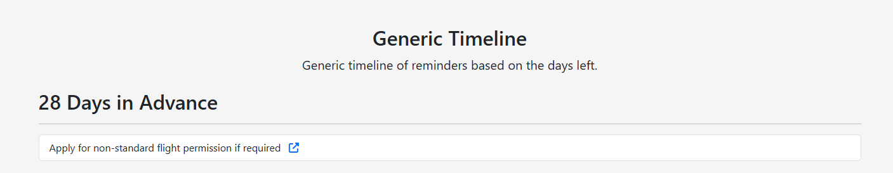

# JSON Templates

Documentation to explain the use of JSON in the project.

# Table of Contents

1. [What Features use JSON Templates](#what-features-use-json-templates)
   - [JSON keys](#json-keys)
2. [Examples JSON](#examples-json)
   - [Checkbox inputs](#checkbox-inputs)
   - [Text, Date, Textarea inputs](#text-date-textarea-inputs)
   - [Url Inputs](#url-input)
3. [Creating new templates](#create-new-templates)
    - [What to do](#what-to-do)
4. [Things to Note](#things-to-note)


## What Features use JSON Templates
- Loading List: Equipment, Group Equipment, Crew List, Maintenance Kit, Safety Kit 
- Checklists: Rural Checklist, Urban Checklist
- Required Forms: Risk Analysis, Site Evaluation, Viability Study
- Pre flight form & Post flight form
- Static Timeline

### JSON keys 

- "header" key in the json controls the header for the form.
- "sections" key is used to hold lists of sections of the form so to have different groupings of a form with different headers and types of fields.
- "fields" key is a list that holds all the fields relating to form in a specific section.
- "id" key is used to uniquely identify the field.
- "name" key is used to display the contents of the field in a user friendly format.
- "value" key is used for the form to store the value of the form based on user input or default value assigned to the field. 
- "type" key is to determine the type of form input so for example "checkbox", "text", "date", "textarea". 
- "required" key is used in the form to determine if its required or not.
- "description" key is used to describe a form input which is used in the checkbox templates.

## Examples JSON
### Checkbox inputs

``` py
LoadingListMaintenanceKitTemplate = [
{
  "title": "Loading List - Maintenance Kit",
  "header": "Ensure all maintenance kit items are checked before proceeding.",
  "form": {
    "sections": [
      {
        "header": "Maintenance Equipment",
        "fields": [
          {"id": "props", "name": "Spare props", "value": "", "type": "checkbox", "required": False},
          {"id": "cables", "name": "Spare cables", "value": "", "type": "checkbox", "required": False},
          {"id": "allenkeys", "name": "Allen keys", "value": "", "type": "checkbox", "required": False},
          {"id": "screwdrivers", "name": "Screwdrivers", "value": "", "type": "checkbox", "required": False},
          {"id": "calibration", "name": "Calibration platform", "value": "", "type": "checkbox", "required": False}
        ]
      }
    ]
  }
}
]
```
#### Form using the JSON template above

### Text, Date, Textarea inputs

``` py
ViabilityStudyTemplate = [
{
  "title": "Viability Study",
  "header": "Analysing risks, requirements, and operational feasibility",
  "form": {
    "sections": [
      {
        "header": "Flight Information",
        "fields": [
          {"id": "flightcode", "name": "Flight Code", "value": "", "type": "text", "required": True},
          {"id": "description", "name": "Description", "value": "", "type": "textarea", "required": True},
          {"id": "flightdate", "name": "Flight Date", "value": "", "type": "date", "required": True},
          {"id": "allowedUsers", "name": "Project Members", "type": "div"}
        ]
      }
```
#### Form using the JSON template above


### Url input
``` py
Timeline_data = [
{
  "sections": [
    {
      "title": "28 Days in Advance",
      "items": [
        {
          "text": "Apply for non-standard flight permission if required",
          "url": "https://nsf.nats.aero/drones-and-model-aircraft/"
        }
      ]
    }

```
#### Form using the JSON template above


## Create new templates
### What to do
#### First Step - Create JSON Template
1. Create the a JSON template in the directory ```\app\forms\jsons```
2. Use the one of the structures that fits your need text, checkbox etc.

#### Second Step - Load JSON into the Database
1. In the root of the project folder go to ```routes_new_project.py```
2. Import the template you just created ```from app.forms.jsons.TemplateFileName import JSON```
3. Scroll to the project initation for the jsons it should look like this:
``` py  
# JSON forms
  viabilityStudy = viability_study_value,
  siteEvaluation = site_evaluation_value,
  riskAnalysis = riskAnalysisTemplate[0],
  toggles = togglesJSON,
```
4. Add the JSON template to the project ```formName = TemplateName[0]```
5. Navigate to the root of the project to a file called ```models.py``` scroll down to the creating the table project and add your form to the project table for example: 
``` py 
# JSON fields
    viabilityStudy = db.Column(db.JSON, nullable=True)
    siteEvaluation = db.Column(db.JSON, nullable=True)
    riskAnalysis = db.Column(db.JSON, nullable=True)
```
#### Third Step - Backend
1. Navigate to the file ```routes_forms.py``` in the project root
2. Create a route for the form that you are going to create it could look like something like this:
``` py
# Loading List EQUIPMENT KIT Form Route (JSON GENERATION)
@app.route("/project/<int:project_id>/loading-list/equipment", methods=["GET", "POST"])
@login_required
def loading_list_equipment(project_id):
    project = Project.query.get_or_404(project_id)  
    security(project)
    
    form_data = project.equipment    
    errors = {}  # validation errors
    
    if request.method == 'POST':
        # Loop through each section
        for section in form_data[0]['form']['sections']:
            # Loop through all fields
            for field in section['fields']:
                field_id = field['id']  
               
                # Handle checkboxes 
                if field['type'] == 'checkbox':  
                    field['value'] = request.form.get(field_id) == "on"  # True if checked
                else:
                    field['value'] = False

        # Any errors? don't commit the changes
        if errors:
            return render_template('/forms/loading/equipment_json.html', project=project, form_data=form_data, errors=errors)

        # Save changes
        project.equipment = form_data
        flag_modified(project, "equipment")
        db.session.add(project)
        db.session.commit()

        flash('Changes saved successfully!', 'success')
    
    return render_template("/forms/loading/equipment_json.html", project=project, form_data=form_data, footer=False, title="Equipment" )
```           
```form_data = project.equipment ``` This code puts the JSON template from the database into a variable to be passed on to the front-end/JINJA.

On form submission the code will loop through the sections in the JSON and extract the keys: ```value, type, id ```. Firstly puts the id into a variable to be used later to grab the value associated with the form ID. Then the code checks if the type is a checkbox and if so if the checkbox is ticked put it into value if not put false into value. 

At the very end of the code is where it submits the user response to the form into the database to be stored. Firstly puts the form data into the database then flag it as modified to be tracked and then commits the changes to the project table.


3. More information on the backend and how the form generation can be found here [Form Generation Docs](formGeneration.md) 


## Things to note
> [!NOTE]
> The `riskAnalysisTemplate.py` uses Javascript to generate read-only text fields based on the selected hazards.
> These readonly Sections are `Existing Control` and `Further Actions`. 
> The JavaScript works by taking the hazard the user has selected and the ID associated with it and checks if the IDs match for the existing control, further actions, with the value from the hazard selected.
> 
> It does this by removing the prefix from the id for example: If you pick the hazard `compliance` the hidden field will grab the hazards value and then the JavaScript will grab the value from the hidden field then check if the hidden field value equals any of the further actions & existing controls by appending the value with the prefix of their IDs `_furtheraction` or `_control`.
> 
> If the IDs match, then it shows the existing field and further action related to the hazard.

### Example
So for example if you wanted to create a new hazard with its associated Further action and Control this is how you would do it:

```{"id": "test", "name": "This is a example","value":"","required": True}```  - Hazards Identified section

```{"id": "test_control", "name": """This is a example control.""","tooltip": "This section of the form is autogenerated based on hazard selected."},``` - Existing Control section

```{"id": "test_further_action", "name": """This is a example further action. ""","tooltip": "This section of the form is autogenerated based on hazard selected."}, ``` - Further Actions section

The example above shows the process of making another hazard and its coresponding further action and existing control.